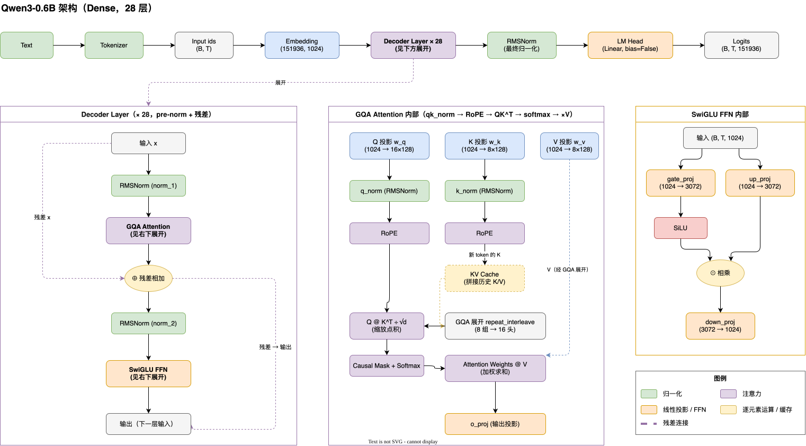

# mini-qwen3

从零实现 Qwen3 的架构（对齐官方 Qwen3-0.6B）。



## 目标

- [x] 配置：对齐官方 Qwen3-0.6B（TypedDict，字段与官方 config.json 一致）
- [x] RMSNorm（fp32 计算 + 可学习 weight）
- [x] SwiGLU FFN（gate / up / down 三投影，bias=False）
- [x] RoPE 旋转位置编码（theta_base=1e6，与 Qwen 官方 rotate_half 一致）
- [x] GQA 注意力（n_kv_groups=8、head_dim=128、qk_norm、kv_cache）
- [x] TransformerBlock（pre-norm + 残差）
- [x] Qwen3 整体模型（embedding / 28 层 / 最终 norm / lm_head）
- [x] 加载官方权重 + 对话生成
- [x] MoE 专家混合（TopKRouter + fused gate_up，为 30B-A3B 方向铺路）
- [ ] tokenizer（目前用 transformers AutoTokenizer，计划自研）

> 注：当前 0.6B 模型是 **Dense** 架构（普通 FFN）；`moe.py` 是 Qwen3-MoE（30B-A3B）的独立模块，后续可替换 `tf_block.py` 里的 FFN 接入 28 层模型。

## 运行

```bash
uv sync --all-packages          # 仓库根目录执行一次，装齐所有轮子的依赖
uv run python tests/run_tests.py   # 单元测试（按模块拆分，覆盖全部实现文件 + 模型集成 + MoE）

# 生成对话（首次需下载 ~1.2GB 权重，需 huggingface-cli login）
uv run python generate.py

# 资源占用统计（随机权重，无需下载）
uv run python profiling.py
```

## 结构

```
config.py      # Qwen3-0.6B 配置（TypedDict，与官方 config.json 对齐）
rms_norm.py    # RMSNorm
ffn.py         # SwiGLU FFN
rope.py        # RoPE 旋转位置编码 + sin/cos 表
gqa.py         # GQA 注意力（qk_norm / kv_cache）
tf_block.py    # TransformerBlock（pre-norm + 残差）
model.py       # Qwen3：embedding + 28 层 + norm + lm_head
moe.py         # MoE 专家混合（TopKRouter / fused gate_up / top-k 路由），Dense 模型不启用
tokenizer.py   # 自研 tokenizer（TODO）
load_qwen3.py  # 加载官方 Qwen3-0.6B safetensors 权重（名字映射 + shape 校验）
generate.py    # 对话生成（chat template + kv_cache 流式）
profiling.py     # 内存 / 延迟 / 生成速度统计
tests/        # 按模块拆分的单元测试（test_<模块>.py 可单独跑，run_tests.py 统一入口）
```

## MoE（`moe.py`）

Qwen3 系列里只有大模型用 MoE：**30B-A3B / 235B-A22B**（A3B = 3B 激活参数），小模型（0.6B~32B）都是 Dense。`moe.py` 实现了 MoE 版本的 FFN，对齐官方 `Qwen3MoeSparseMoeBlock`

## 参考

- Qwen3 技术报告: <https://arxiv.org/abs/2505.09388>
- Qwen3-0.6B 模型卡: <https://huggingface.co/Qwen/Qwen3-0.6B>
- RoPE 旋转位置编码: <https://arxiv.org/abs/2104.09864>
- GQA 分组查询注意力: <https://arxiv.org/abs/2305.13245>
- SwiGLU: <https://arxiv.org/abs/2002.05202>
- RMSNorm: <https://arxiv.org/abs/1910.07467>
